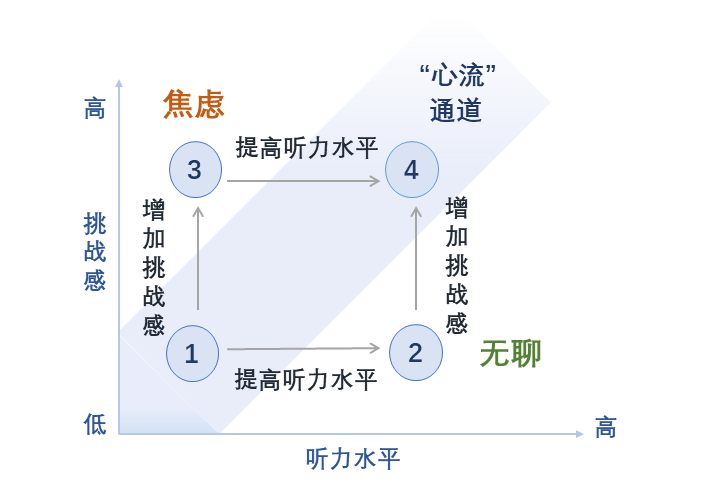

# 英语听力学习笔记

## Day 1 技巧综合课

    一.chunk化：Chunk化输入，就是把语句拆分成有意义的模块和语块，然后再向大脑输入。 它可以帮助我们处理长难句，提高理解英语的反应速度，同时还可以避免尴尬的歧义。
    Chunk化输入有2个步骤。：
    1、通过引导词划分出大Chunk：主谓宾、连词/介词
    2、通过意群划分出小Chunk：意思相近的同类句子
    有效的划分chunk的方法—：刻意听音频停顿的地方。句子长了，读的人也需要歇口气，而往往停顿的地方就是意群划分的地方。
    二.泛化和语序
    解决的问题:难以理解句子/知道单词意思却不知道整体的意思
    方法:中英文修饰语的位置通常相反/理解单词最根源的抽象意义
    在泛化和语序这一节中主要讲了中英文思维差异导致的语言顺序差异。 
    在英语中，修饰语的位置通常与中文相反。我们还介绍了泛化这个概念。 在英文当中，一个词的意义可以有很多，掌握其全部意思的关键就在于，从根源上去理解这个词最抽象的含义。 放在实际运用中，也就算是说让大家不查词典，直接从句子整体意思上推测动词意思～ 这招别看扯淡似的，但十分好用！
    比如手机没电了怎么说？其实不用去想电池怎么说，没电了怎么说我们去想这件事的状态是什么，它是说我们的手机没办法继续用了所以就是：My phone is dead. 想想，我的手机死了，不就是没电了嘛！My phone is dead.既形象，又生动
    总结来说英语学习步骤：认->听->读->写。

## Day 2 技巧综合课

    一.辅元连读：前一个单词辅音结尾，后一个单词元音开头，就可以辅元连读，把他们变成一个音
        如：take it ,hook up,not at all,look at it
    二.叠音失爆同化
        叠音：前一个单词以辅音结尾，后一个单词以相同的辅音开头，就可以直接读一个音就好了
        如：want to , some money , black coffee , part time , good doctor
        失爆（失去爆破）：前一个单词以爆破音结束，后一个单词以爆破音开头
        如：big big world , black board , sit down
        同化：前一个单词以 /t/ , /d/ , /s/ , /z/读音结尾，后一个以半元音开头(/w/ , /j/),
        /t/和/j/同化成/tʃ/，比如：without you 就变成了/tʃ/的声音
        而would you读音就变为了： /dʒ:ju/
    三.口语技巧
        1.闪音：发音时，舌尖向上卷起，但直接接触齿龈或者上颚。气流冲出时，舌尖轻微闪颤一下，与齿龈或上颚接触，瞬间即离开。
        比如：/t/读/d/,/p/读/b/,/k/读/g/
        2./t/读音省略：将句子中的/t/轻读以至于不发声
        3.轻轻音：辅音都轻轻的读，将元音重读
        4.松紧音：松紧音可以分清近似单词的区别
        如：seat/i:/和sit/I/ ， heat/i:/和hit/I/ ， peach/i:/和pitch/I/
    听力提升技巧：
    建立仪式感->设置小目标->度过沉默期
    每天固定时间学习，设置目标，完成目标之后会产生正反馈，然后坚持，度过瓶颈期之后就可以进步了。

学习听力的过程

## Day 3 技巧综合课

    一.数字专练
        识别数字的难点：
        数字之间没有停顿
        数字没有上下文提示
        英文数字的表达习惯与中文不同
        单位：
        百     hundred
        千     thousand
        万     ten thousand
        十万   a hundred thousand
        百万   million
        千万   ten million
        十亿   billion

        方法一：摆脱翻译，把单词和数字直接对应，这就需要我们对数字有一定的熟练度
        方法二：习惯使用千分符
        比如： a thousand 看作千位上是1
               a million  看作百万位上是1
               a billion  看作十亿位上是1
        方法三：融入到日常生活
        如车牌号：川A27384  
        读作   two seven three eight four 
        或者   twenty seven thousand three hundred and eight four 

        (1)年号的读法：
    　　1979←→nineteen seventy-nine or nineteen hundred(and)seventy-nine;
        1999←→nineteen (and) ninety-nine
        2008←→two thousand (and) eight
        763←→seven sixty-three

    　　(2)电话号码、货币的读法：
    　　1023←→one o two three;
        1227←→one double two(or two two)seven;
        4.25←→four dollars(and)twenty-five(cents);

    　　(3)小数点的读法：
    　　13.91←→thirteen decimal(point)nineone;0.23=nought demical two three;

    　　(4)算术式的读法：
    　　2+3=5 Two plus three is(equals,isequal to)five.
    　　5-3=2 Five minus three is equal to two.
    　　3×2=6 Three times two is six.or Three by two are six.
    　　9÷3=3 Nine divided bythreemakesthree.

        (5).一串数字的读法
        一个一个读：
        3.1415926 three point one four one five nine two six

        (6)金额的读法 如：5.95$
        把单位全部念出来：five point nine five dollars
        只念数字和小数点：five point ninety five
        只念数字：five niinety five
        
        (7)区分十几和几十的读音
            <1>重音，十几在后，几十在前
            <2>teen发音较长，有鼻音；ty发音较短，没有鼻音

        (8)关于世纪的读法(比如：20世纪)
        20th century = 1900s
        twentieth century = nineteen-hundreds
    二.听懂逻辑
        关注导语：when where what why who how
            了解导语可以帮助1预测全文框架
        关注阐述者
        关注关键词
        解释/说明/举例词：that's to say,in other words ,for example
        连接/过渡词：first/second/third , in addition , besides
        转折/对比词：but , however , neither...nnor , unlike
        态度观点词：unhappy/happy , dis/satisfied , negative , positive
